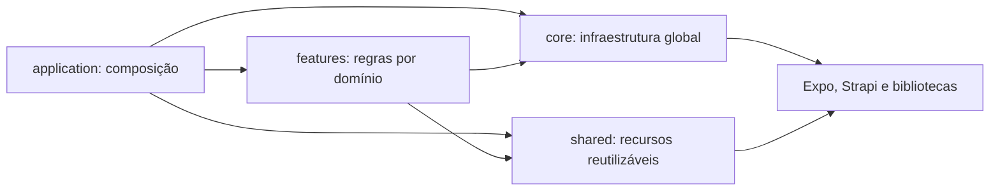

# AppRotas — Suporte Drogal

Aplicativo mobile para apoiar equipes em campo com criação de rotas entre
filiais, consulta de lojas no mapa, pontos de interesse, chamados, inventário
de equipamentos e registro de atividades no Strapi.

O projeto utiliza React Native, Expo e TypeScript estrito. A organização é
orientada a funcionalidades (`feature-first`): cada domínio mantém próximos
seus componentes, hooks, modelos, telas, serviços e casos de uso.

## Funcionalidades

- Autenticação com JWT, restauração e expiração automática da sessão.
- Verificação automática de novas versões do aplicativo.
- Menus dinâmicos por cargo e setor, carregados do Strapi.
- Registro de sessão com usuário, setor e cidade de origem.
- Busca, ordenação e navegação por rotas entre filiais.
- Abertura de rotas no Google Maps e no Waze.
- Mapa de filiais e pontos de interesse com agrupamento de marcadores.
- Cadastro de restaurantes e postos com identificação do usuário criador.
- Histórico por usuário, período, cidade de origem e tipo de destino.
- Fila local para históricos que não puderam ser enviados ao Strapi.
- Consulta de chamados atribuídos e não atribuídos.
- Lista de contatos com filtros por texto e departamento.
- Checklist de preventiva e relatório de patrimônio compartilhável.
- Envio de sugestões, melhorias e problemas.
- Tema claro/escuro e componentes do React Native Paper.

## Tecnologias principais

- React 19 e React Native 0.81
- Expo SDK 54
- TypeScript 5.9
- React Navigation 7
- React Native Paper
- React Native Maps
- Axios
- AsyncStorage
- Strapi

## Arquitetura

```text
src/
├── application/
│   ├── navigation/       # composição e tipos da navegação
│   └── providers/        # composição dos providers da aplicação
├── core/
│   ├── api/              # cliente e contratos genéricos do Strapi
│   ├── auth/             # sessão autenticada e menus
│   ├── config/           # configuração por ambiente
│   ├── location/         # permissão, coordenadas e cidade atual
│   └── theme/            # tema e preferências visuais
├── features/
│   ├── admin/
│   ├── atualizacao/
│   ├── auth/
│   ├── chamados/
│   ├── contatos/
│   ├── configuracoes/
│   ├── filiais/
│   ├── historico/
│   ├── pontos/
│   ├── preventiva/
│   ├── rotas/
│   └── sugestoes/
└── shared/
    ├── components/       # componentes reutilizados entre domínios
    ├── hooks/            # hooks genéricos
    ├── icons/            # utilitários de ícones
    └── maps/             # coordenadas e agrupamento de marcadores
```

### Direção das dependências



Regras adotadas:

- `application` monta a aplicação, mas não contém regra de negócio. Esse nome
  também evita conflito com o diretório `src/app` reservado pelo Expo Router.
- `core` concentra infraestrutura global e não depende de uma feature.
- `shared` não conhece regras específicas de uma feature.
- cada feature expõe sua própria tela, estado, modelo e operações;
- telas coordenam interface; não implementam persistência ou regra de negócio;
- hooks contêm integração com React, contexto e ciclo de vida;
- casos de uso orquestram regras de negócio sem depender da interface;
- serviços encapsulam integrações com sistema operacional ou armazenamento.

### Estrutura interna de uma feature

Nem toda feature precisa de todas as pastas. Elas são criadas somente quando
há uma responsabilidade real:

```text
feature/
├── components/           # interface exclusiva da feature
├── hooks/                # estado e integração com React/API
├── models/               # contratos e tipos do domínio
├── screens/              # telas registradas na navegação
├── services/             # armazenamento ou integração externa
├── useCases/             # orquestração das regras de negócio
└── FeatureContext.tsx    # estado compartilhado apenas pelo domínio
```

## Convenções de código

### Extensões

- `.tsx`: arquivos que renderizam JSX, como telas, componentes, providers e
  contextos.
- `.ts`: hooks sem JSX, modelos, casos de uso, serviços, configurações,
  utilitários e estilos.
- JavaScript/JSX não faz parte do código ativo em `src`.

### Nomes

- Componentes e telas: `PascalCase`, por exemplo `PontosScreen.tsx`.
- Hooks: prefixo `use` e `camelCase`, por exemplo `useHistoricoRotas.ts`.
- Casos de uso: verbo no infinitivo, por exemplo
  `registrarHistoricoRota.ts`.
- Estilos: nome do componente seguido de `.styles.ts`.
- Modelos: nome do conceito em `PascalCase`.
- Nomes do contrato do Strapi permanecem iguais aos do backend para evitar
  mapeamentos implícitos e regressões.

## Fluxos de negócio importantes

### Login e sessão

1. O aplicativo autentica em `/auth/local`.
2. Carrega os menus permitidos para o cargo e setor.
3. Valida e persiste o JWT e o usuário.
4. Resolve a cidade atual quando houver permissão de localização.
5. Registra a sessão em `/sessoes`.

Uma falha no monitoramento da sessão não bloqueia o login.

### Verificação de versão

Ao iniciar, o aplicativo consulta o single type `update-app` e compara a versão
disponível com a versão definida no Expo. A comparação é numérica por segmento,
portanto versões como `2.0.10` são tratadas corretamente. O aviso é sempre
opcional e pode abrir um link externo ou o APK publicado no Strapi.

### Rota entre filiais

1. O usuário pesquisa e adiciona uma ou mais filiais.
2. Escolhe Google Maps ou Waze.
3. O caso de uso tenta registrar o histórico.
4. Se o Strapi estiver indisponível, o histórico entra na fila local.
5. A navegação externa continua mesmo se o histórico não puder ser persistido.

### Rota para ponto de interesse

O cadastro de um ponto **não cria histórico**. O histórico só é criado quando:

1. o usuário abre o menu de pontos;
2. seleciona um marcador;
3. toca no botão `Traçar rota`;
4. o Google Maps é aberto com sucesso.

O tipo registrado é `restaurante` ou `posto_combustivel`. Se o envio falhar,
o mesmo mecanismo de fila offline é utilizado.

### Histórico offline

Os registros pendentes ficam no AsyncStorage sob uma chave versionada da
aplicação. A sincronização é tentada de forma oportunista ao entrar no fluxo
de rotas e antes de novos registros de lojas. Registros antigos sem os campos
mais recentes continuam compatíveis na leitura.

## Integração com o Strapi

O aplicativo espera os endpoints abaixo. Os nomes representam o contrato atual
do código; mudanças no Strapi devem ser refletidas nos modelos da respectiva
feature.

### `sessoes`

| Campo | Tipo recomendado | Uso |
| --- | --- | --- |
| `user` | Texto curto | Username autenticado |
| `setor` | Texto curto | Setor do usuário |
| `cidadeOrigem` | Texto curto | Cidade resolvida no login |

### `historico-visitas`

| Campo | Tipo recomendado | Uso |
| --- | --- | --- |
| `datahora` | DateTime | Instante original da ação |
| `username` | Texto curto | Usuário que iniciou a rota |
| `setor` | Texto curto | Setor do usuário |
| `cidadeOrigem` | Texto curto | Cidade de início |
| `tipoHistorico` | Enumeration | `loja`, `restaurante` ou `posto_combustivel` |
| `rotas` | JSON | Destinos e ordem da rota |

Exemplo de `rotas`:

```json
[
  {
    "codigofilial": 1,
    "nomefilial": "Filial Centro",
    "nomecidade": "Piracicaba",
    "ordem": 1
  }
]
```

### `pontos-interesses`

| Campo | Tipo recomendado |
| --- | --- |
| `latitude` | Texto curto ou Decimal, conforme o contrato existente |
| `longitude` | Texto curto ou Decimal, conforme o contrato existente |
| `descricao` | Texto curto |
| `categoria` | Enumeration: `Restaurante`, `Posto de Combustível` |
| `usernameCriador` | Texto curto |

### Outras coleções utilizadas

- `update-app` (single type): `versao`, `appUrl` e mídia `appApk`.
- `informacoeslojas`: dados e coordenadas das filiais.
- `menus`: título, rota, ícone, situação, ordem e relação com setores.
- `chamados`: chamados filtrados por responsável e setor.
- `contatos`: `departamento`, `colaboradores`, `ramal`, `ddr` e `email`.
- `sugestoes`: `user`, `setor`, `email`, `tipo`, `tela`, `sugestao` e
  `situation`.

Os papéis autenticados do Strapi precisam das permissões `find`, `findOne` ou
`create` somente nas coleções exigidas pelo fluxo de cada usuário.

## Configuração

Requisitos:

- Node.js 18 ou superior;
- Yarn;
- Android Studio/SDK para execução nativa no Android;
- Xcode para execução nativa no iOS.

Instale as dependências:

```bash
yarn install
```

Copie o arquivo de exemplo:

```bash
cp .env.example .env.local
```

Configure a API:

```dotenv
EXPO_PUBLIC_STRAPI_URL=http://localhost:1337/api
```

O código preserva os endereços atuais como fallback para compatibilidade.
Em builds distribuídos, configure `EXPO_PUBLIC_STRAPI_URL` no ambiente do EAS.

## Execução

```bash
# Metro/Expo
yarn start

# Android nativo
yarn android

# iOS nativo
yarn ios

# Web
yarn web

# validação estática
yarn typecheck
```

Quando houver problema de cache:

```bash
npx expo start --clear
```

## Segurança

- Nunca coloque tokens JWT, senhas ou segredos do Strapi no aplicativo.
- Variáveis `EXPO_PUBLIC_*` ficam disponíveis no bundle e não devem conter
  segredos.
- Chaves de Google Maps usadas por aplicativos móveis também ficam no pacote;
  restrinja-as no Google Cloud pelo package/bundle identifier e pelas APIs
  estritamente necessárias.
- Use HTTPS no Strapi em produção.
- Conceda no Strapi apenas as permissões necessárias para cada papel.

## Qualidade e evolução

Antes de entregar uma alteração:

1. mantenha a regra dentro da feature proprietária;
2. extraia orquestrações de negócio para `useCases`;
3. não faça uma feature importar arquivos internos de outra sem necessidade;
4. atualize os modelos quando o contrato do Strapi mudar;
5. execute `yarn typecheck`;
6. valide manualmente login, mapas, criação de ponto e histórico offline quando
   a alteração atingir esses fluxos.

Próximos passos recomendados:

- testes unitários dos casos de uso de histórico;
- testes de integração dos hooks do Strapi;
- idempotência no backend para evitar histórico duplicado após sincronização;
- monitor de conectividade para sincronização automática;
- lint e formatação automatizados no CI;
- migração da API de produção para HTTPS.
