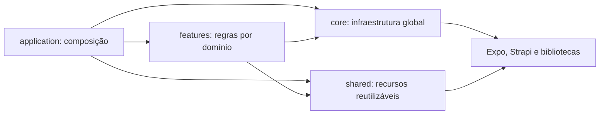

# AppRotas — Suporte Drogal

Aplicativo mobile para apoiar equipes em campo com criação de rotas entre
filiais, consulta de lojas no mapa, pontos de interesse, chamados, inventário
de equipamentos e registro de atividades no Strapi.

O projeto utiliza React Native, Expo e TypeScript estrito. A organização é
orientada a funcionalidades (`feature-first`): cada domínio mantém próximos
seus componentes, hooks, modelos, telas, serviços e casos de uso.

> Este é o projeto móvel. Para iniciar a solução completa e consultar a
> documentação do backend, veja o [README da raiz](../README.md).

Documentação técnica desta camada:

- [Arquitetura e módulos](./docs/ARQUITETURA_E_MODULOS.md)
- [Contrato detalhado do monitoramento](./docs/STRAPI_MONITORAMENTO_ROTAS.md)
- [Módulo opcional da assistente](./src/features/assistente/README.md)
- [Regras integradas do sistema](../docs/SISTEMA_E_REGRAS.md)

## Funcionalidades

- Autenticação com JWT, restauração e expiração automática da sessão.
- Verificação automática de novas versões do aplicativo.
- Menus dinâmicos por cargo e setor, carregados do Strapi.
- Registro de sessão com usuário, setor e cidade de origem.
- Busca, ordenação e navegação por rotas entre filiais.
- Assistente global opcional, controlada pelo Strapi, com interpretação local
  de comandos, consulta factual das filiais e fallback automático para a
  bolinha de sugestões.
- Abertura de rotas no Google Maps e no Waze.
- Registro de percursos iniciados pelo usuário, com GPS em segundo plano,
  conclusão automática, execução parcial, fila SQLite por colaborador,
  duração, distância, chegadas e desvios.
- Mapa de filiais com distribuição por cidade/estado, filtros analíticos e
  agrupamento de marcadores; pontos de interesse também usam agrupamento.
- Cadastro de restaurantes e postos com identificação do usuário criador.
- Histórico por usuário, período, cidade de origem e tipo de destino.
- Fila local para históricos que não puderam ser enviados ao Strapi.
- Consulta de chamados atribuídos e não atribuídos.
- Lista de contatos com filtros por texto e departamento.
- Registro de patrimônio por serviço, com checklist específico de preventiva
  e relatório compartilhável.
- Envio de sugestões, melhorias e problemas.
- Tema claro/escuro e componentes do React Native Paper.
- Perfil com e-mail Drogal (`emailSec`) e alteração autenticada de senha.

## Tecnologias principais

- React 19 e React Native 0.81
- Expo SDK 54
- TypeScript 5.9
- React Navigation 7
- React Native Paper
- React Native Maps
- Axios
- AsyncStorage
- Expo SQLite e Expo Task Manager
- Strapi

## Arquitetura

```text
src/
├── application/
│   ├── navigation/       # composição e tipos da navegação
│   └── providers/        # composição dos providers da aplicação
├── core/
│   ├── api/              # cliente e contratos genéricos do Strapi
│   ├── auth/             # estado da sessão autenticada
│   ├── config/           # configuração por ambiente
│   ├── location/         # permissão, coordenadas e cidade atual
│   ├── menu/             # contrato compartilhado dos menus
│   └── theme/            # tema e preferências visuais
├── features/
│   ├── admin/
│   ├── atualizacao/
│   ├── auth/
│   ├── chamados/
│   ├── contatos/
│   ├── configuracoes/
│   ├── execucaoRota/     # execução, GPS, fila local e sincronização
│   ├── filiais/
│   ├── historico/
│   ├── menus/            # acesso, sincronização e interface dos menus
│   ├── pontos/
│   ├── patrimonio/       # equipamentos, posições e relatório por serviço
│   ├── rotas/
│   └── sugestoes/
└── shared/
    ├── components/       # componentes reutilizados entre domínios
    ├── hooks/            # hooks genéricos
    ├── icons/            # utilitários de ícones
    └── maps/             # coordenadas e agrupamento de marcadores
```

### Direção das dependências



Regras adotadas:

- `application` monta a aplicação, mas não contém regra de negócio. Esse nome
  também evita conflito com o diretório `src/app` reservado pelo Expo Router.
- `core` concentra infraestrutura global e não depende de uma feature.
- `shared` não conhece regras específicas de uma feature.
- cada feature expõe sua própria tela, estado, modelo e operações;
- telas coordenam interface; não implementam persistência ou regra de negócio;
- hooks contêm integração com React, contexto e ciclo de vida;
- casos de uso orquestram regras de negócio sem depender da interface;
- serviços encapsulam integrações com sistema operacional ou armazenamento.

### Estrutura interna de uma feature

Nem toda feature precisa de todas as pastas. Elas são criadas somente quando
há uma responsabilidade real:

```text
feature/
├── components/           # interface exclusiva da feature
├── hooks/                # estado e integração com React/API
├── models/               # contratos e tipos do domínio
├── screens/              # telas registradas na navegação
├── services/             # armazenamento ou integração externa
├── useCases/             # orquestração das regras de negócio
└── FeatureContext.tsx    # estado compartilhado apenas pelo domínio
```

## Convenções de código

### Extensões

- `.tsx`: arquivos que renderizam JSX, como telas, componentes, providers e
  contextos.
- `.ts`: hooks sem JSX, modelos, casos de uso, serviços, configurações,
  utilitários e estilos.
- JavaScript/JSX não faz parte do código ativo em `src`.

### Nomes

- Componentes e telas: `PascalCase`, por exemplo `PontosScreen.tsx`.
- Hooks: prefixo `use` e `camelCase`, por exemplo `useHistoricoRotas.ts`.
- Casos de uso: verbo no infinitivo, por exemplo
  `registrarHistoricoRota.ts`.
- Estilos: nome do componente seguido de `.styles.ts`.
- Modelos: nome do conceito em `PascalCase`.
- Funções exportadas, hooks e casos de uso devem ter um comentário `/** */`
  curto descrevendo responsabilidade e comportamentos que não sejam óbvios.
- Nomes do contrato do Strapi permanecem iguais aos do backend para evitar
  mapeamentos implícitos e regressões.

## Fluxos de negócio importantes

### Login e sessão

1. O aplicativo autentica em `/auth/local`.
2. Solicita ao Strapi, em `/menus/me`, somente os menus permitidos para o
   usuário autenticado.
3. Valida e persiste o JWT e o usuário.
4. Resolve a cidade atual quando houver permissão de localização.
5. Registra a sessão em `/sessoes`.

Uma falha no monitoramento da sessão não bloqueia o login.
Os acessos do menu são sincronizados silenciosamente quando uma sessão salva é
restaurada, quando o aplicativo volta ao primeiro plano e a cada cinco minutos
de uso ativo. Se o Strapi estiver indisponível, os últimos acessos válidos são
preservados.

### Senha temporária no primeiro acesso

O campo Boolean `deveAlterarSenha` do usuário nasce como `true`. O
`ForcedPasswordChangeGate` consulta `GET /troca-senha-obrigatoria/status`
e persiste a última decisão válida junto ao perfil. Ao reabrir o aplicativo
offline, um perfil que já concluiu a troca é liberado imediatamente e a
consulta é tentada em segundo plano; um perfil marcado como pendente continua
bloqueado. Ausência de uma decisão booleana local não libera o acesso. Quando
necessário, o modal de senha é aberto em modo não dispensável e envia a
alteração para `POST /troca-senha-obrigatoria`.

O módulo está isolado em `core/auth/forcedPasswordChange`. Uma futura
autenticação corporativa pode desativá-lo removendo somente o wrapper
`ForcedPasswordChangeGate` de `application/providers/AppProviders.tsx`; o
`AuthContext`, a navegação e as demais features não dependem dessa regra.

### Menus dinâmicos

O campo `rota` do Strapi é o identificador técnico usado pela navegação. O
campo `titulo` é somente o texto apresentado ao usuário e pode ser alterado sem
quebrar a rota. As rotas suportadas ficam centralizadas em
`application/navigation/menuRegistry.ts`.

Menus inativos, rotas desconhecidas e rotas técnicas duplicadas não são
registrados no navegador. As regras de cargo e setor são aplicadas pelo
backend; o aplicativo recebe apenas os acessos autorizados e valida o formato
da resposta antes de atualizar a navegação. Durante o login, o JWT é enviado
explicitamente porque a sessão ainda não foi publicada no contexto global.

Ao sair ou entrar com outro usuário, os providers que mantêm dados de filiais,
pontos, chamados e histórico são recriados com uma chave de sessão. Isso evita
que dados mantidos em memória por uma conta apareçam para a conta seguinte.
O provider de execução de rota permanece acima desse limite para finalizar ou
sincronizar com segurança uma execução pertencente à sessão anterior.

As rotas atualmente aceitas no Strapi são: `Home`, `MapaLojas`, `Historico`,
`Pontos`, `Patrimonio`, `Chamados`, `Contatos` e `Admin`.

Para abrir o registro de patrimônio, o menu deve usar `Patrimonio` no campo
`rota`. O texto exibido ao usuário é definido separadamente no campo `titulo`.

### Verificação de versão

Ao iniciar, o aplicativo consulta o single type `update-app` e compara a versão
disponível com a versão definida no Expo. A comparação é numérica por segmento,
portanto versões como `2.0.10` são tratadas corretamente. Quando existe uma
versão superior, a atualização é obrigatória e bloqueia o uso do aplicativo. O
usuário pode abrir um link externo ou o APK publicado no Strapi, mas não pode
dispensar o aviso.

### Rota entre filiais

1. O usuário pesquisa e adiciona uma ou mais filiais.
2. `Traçar rota` abre uma prévia dentro do aplicativo com o caminho, distância
   e tempo estimado, sem criar execução ou histórico.
3. Se a intenção era somente consultar, o usuário fecha a prévia.
4. `Iniciar percurso` abre a escolha entre Google Maps e Waze.
5. Somente depois dessa confirmação o aplicativo cria a execução local,
   inicia o GPS e abre o navegador externo.
6. Os pontos ficam no SQLite e são sincronizados em lotes idempotentes.
7. Cada destino exige três leituras consecutivas próximas para ser confirmado.
8. A rota é concluída automaticamente quando todos os destinos são
   confirmados.
9. Se apenas parte for realizada, os destinos visitados permanecem registrados
   como execução parcial.
10. O usuário só precisa interromper manualmente quando abandonar a rota.

Se o Strapi ou a estimativa estiver indisponível, a última configuração válida
do monitoramento é recuperada do armazenamento local. Uma configuração ativa
mantém a gravação do percurso e permite continuar sem a prévia; Maps ou Waze
continuam abrindo normalmente.

O cálculo da prévia só ocorre ao tocar em `Traçar rota`; pesquisar uma filial
não consulta a Routes API. Se a prévia for fechada, ela permanece em memória e
é reaproveitada por até 10 minutos enquanto a lista, a ordem dos destinos e a
origem permanecerem válidas. Antes de decidir entre cache e nova consulta, o
aplicativo atualiza o GPS; um deslocamento superior a 500 metros invalida a
estimativa. Ao iniciar o percurso, o mesmo planejamento é enviado à execução,
evitando uma segunda consulta ao Google.

### Rota para ponto de interesse

O cadastro de um ponto **não cria histórico**. Ao tocar em `Traçar rota`, a
prévia interna mostra o caminho e a estimativa sem iniciar uma viagem. O mesmo
registro das filiais começa para o restaurante ou posto somente depois de
`Iniciar percurso`. Abrir a prévia, isoladamente, não comprova uma visita.

O tipo registrado é `restaurante` ou `posto_combustivel`. Se o Strapi estiver
indisponível, a execução e seus pontos permanecem na fila SQLite exclusiva do
usuário.

### Localização durante a rota

Antes de abrir Maps ou Waze, o aplicativo exige localização precisa e acesso
em segundo plano. Durante uma execução ativa, essas condições são verificadas
quando o app volta ao primeiro plano e a cada 15 segundos enquanto permanece
aberto. Se GPS ou permissão forem desativados, a continuidade fica bloqueada
até a correção e a ocorrência é anexada ao resumo da execução.

### Retenção do SQLite

Pontos pendentes nunca são apagados. Depois que o servidor confirma todos os
lotes e a finalização, os pontos detalhados permanecem por sete dias e os
resumos locais por trinta dias. Após esses períodos, a limpeza ocorre
automaticamente; o Strapi permanece como fonte definitiva.

### Agrupamento dos mapas

Os mapas de filiais e pontos utilizam Supercluster. A lista de coordenadas cria
um índice espacial somente quando os dados mudam; movimentos de câmera apenas
consultam esse índice pela região visível e pelo zoom. Pequenas oscilações da
região nativa são ignoradas para evitar que os agrupamentos pareçam se mover
sozinhos. Ao tocar em um cluster, a biblioteca calcula o zoom em que ele começa
a se dividir.

Nos pontos de interesse, registros a até 12 metros são tratados como um mesmo
local apenas para renderização. Um marcador numerado abre a lista de opções,
permitindo escolher, por exemplo, o restaurante ou o posto cadastrado na mesma
coordenada. Os registros originais continuam separados no Strapi.

### Filiais disponíveis offline na tela de Rotas

A busca por código da filial mantém a última lista online válida no aparelho.
O cache é versionado e isolado por servidor e usuário. Ele é usado somente pela
tela de Rotas; mapa, contatos, histórico, pontos e demais módulos continuam com
o comportamento online atual. Respostas `401/403` nunca são ocultadas por dados
locais.

Sem internet, o usuário consegue localizar filiais salvas, montar e ordenar os
destinos. A estimativa de tempo/distância ainda requer a Routes API e pode ser
ignorada pelo botão de continuar sem prévia. Abrir e navegar depende do suporte
offline oferecido pelo Google Maps ou Waze instalado no aparelho.

Uma sessão local com JWT ainda válido também pode ser restaurada offline. O
perfil, os menus e a decisão de troca obrigatória vêm do armazenamento isolado
do usuário; sincronizações remotas posteriores não bloqueiam a abertura da tela
de Rotas. Token expirado, perfil ausente ou primeiro acesso ainda pendente não
são liberados pelo fallback.

### Histórico offline

Os registros pendentes ficam no AsyncStorage em uma chave versionada e
derivada do identificador estável do usuário. Cada item também guarda seu
proprietário, impedindo que a fila criada pelo usuário A seja enviada pela
sessão do usuário B.

A sincronização é tentada de forma oportunista ao entrar no fluxo de rotas e
antes de novos registros de lojas. A chave global usada pelas versões
anteriores é migrada para o usuário autenticado somente depois que a nova fila
é gravada com sucesso. Registros antigos sem os campos mais recentes continuam
compatíveis na leitura.

### Execução monitorada de rotas

O módulo `features/execucaoRota` é independente da interface e do navegador.
Ele mantém uma única viagem ativa no aparelho, registra pontos em segundo
plano, restaura a sessão ao reabrir o aplicativo e interrompe o rastreamento
ao trocar de usuário. Maps, Waze e uma futura navegação interna utilizam o
mesmo contrato.

Todas as mutações do SQLite passam por uma fila única, usam timeout de bloqueio
e repetem somente falhas transitórias. A sincronização ocorre na abertura, no
retorno ao primeiro plano e periodicamente, com intervalo progressivo depois
de falhas. Antes do logout, o app preserva a execução e tenta sincronizá-la por
uma janela limitada, sem deixar a saída do usuário travada.

O resumo do aparelho é provisório. O backend deve recalcular os indicadores a
partir dos segmentos antes de disponibilizá-los ao gestor. O contrato completo
está em
[`docs/STRAPI_MONITORAMENTO_ROTAS.md`](docs/STRAPI_MONITORAMENTO_ROTAS.md).

## Integração com o Strapi

O aplicativo espera os endpoints abaixo. Os nomes representam o contrato atual
do código; mudanças no Strapi devem ser refletidas nos modelos da respectiva
feature.

### `sessoes`

| Campo | Tipo recomendado | Uso |
| --- | --- | --- |
| `user` | Texto curto | Username autenticado |
| `setor` | Texto curto | Setor do usuário |
| `cidadeOrigem` | Texto curto | Cidade resolvida usando a mesma leitura atual de GPS do login |

### `historico-visitas`

A tela e a assistente consultam `GET /api/historico-visitas/me`. O backend
deriva o usuário do JWT e aceita somente intervalo de data e paginação; o app
não envia mais `username` como regra de autorização.

| Campo | Tipo recomendado | Uso |
| --- | --- | --- |
| `datahora` | DateTime | Instante original da ação |
| `username` | Texto curto | Usuário que iniciou a rota |
| `setor` | Texto curto | Setor do usuário |
| `cidadeOrigem` | Texto curto | Cidade resolvida pelas mesmas coordenadas gravadas na origem da execução |
| `tipoHistorico` | Enumeration | `loja`, `restaurante` ou `posto_combustivel` |
| `rotas` | JSON | Destinos e ordem da rota |
| `codigoSessao` | Texto curto, único e opcional | Liga novos históricos a uma execução confirmada |
| `situacaoExecucao` | Enumeration opcional | `concluida` ou `concluida_parcial` |
| `destinosPlanejados` | Integer opcional | Quantidade planejada |
| `destinosVisitados` | Integer opcional | Quantidade confirmada |
| `rotaConfirmadaPorGps` | Boolean opcional | Informa se não houve interrupção da localização |
| `detalhesDestinosVisitados` | JSON opcional | Ordem e horário das confirmações |

Exemplo de `rotas`:

```json
[
  {
    "codigofilial": 1,
    "nomefilial": "Filial Centro",
    "nomecidade": "Piracicaba",
    "ordem": 1
  }
]
```

### `configuracao-app`

Single type com o campo Boolean obrigatório `monitoramentoRotasAtivo`. Quando
está `true`, o aplicativo exibe a prévia e pode iniciar a execução monitorada.
Quando está `false`, nenhuma prévia é calculada, o SQLite/GPS não é iniciado e
o usuário apenas escolhe entre Maps e Waze. Se a configuração não puder ser
lida, o aplicativo reutiliza a última decisão confirmada pelo servidor. Apenas
uma instalação sem decisão anterior utiliza o modo externo como contingência.

O mesmo single type possui `assistenteVozAtivo`, Boolean obrigatório com padrão
`false`. `true` mostra a assistente global; `false` ou ausência do campo mantém
a bolinha de sugestões. A permissão do microfone só é solicitada quando o
usuário tenta falar.

O campo `assistenteIaAtiva`, também Boolean obrigatório e padrão `false`,
habilita somente o fallback online para frases que a árvore local não
reconhecer. Ele não tem efeito com `assistenteVozAtivo = false`. A chave do
provedor permanece exclusivamente no Strapi e todo comando sugerido pela IA é
validado novamente pelo executor local antes de qualquer ação.

No papel `Authenticated`, libere `Configuracao-app > find`. Se usar o fallback
online, libere também `Assistente-ia > interpretar`.

### `execucoes-rotas` e `segmentos-execucao-rota`

As collections, relações, enums e endpoints customizados do registro
estão especificados em
[`docs/STRAPI_MONITORAMENTO_ROTAS.md`](docs/STRAPI_MONITORAMENTO_ROTAS.md).

### `POST /estimativa-rota/calcular`

Endpoint somente de consulta usado pela prévia interna. Aceita a localização
atual em `origin` e os destinos ordenados em `destinations`. A resposta contém
distância, duração e `encodedPolyline`. Ele não cria execução, segmento ou
histórico. O campo singular `destination` continua aceito para versões antigas.

### `pontos-interesses`

| Campo | Tipo recomendado |
| --- | --- |
| `latitude` | Texto curto ou Decimal, conforme o contrato existente |
| `longitude` | Texto curto ou Decimal, conforme o contrato existente |
| `descricao` | Texto curto |
| `categoria` | Texto: `Restaurante`, `Posto de Combustível` |
| `usernameCriador` | Texto curto |
| `cidadePonto` | Texto curto com a cidade da coordenada |
| `setorCriador` | Texto curto com o setor do autor |

O app tenta resolver `cidadePonto` por geocodificação reversa e usa `Não
informado` como contingência. O controller do Strapi sobrescreve
`usernameCriador` e `setorCriador` com os dados do usuário autenticado.

### `audit-logs`

Os registros de auditoria são criados somente depois que a alteração do
cadastro é confirmada pelo Strapi. E-mails, senhas e tokens não são
armazenados.

| Campo | Tipo recomendado | Valores |
| --- | --- | --- |
| `acao` | Enumeration | `ATUALIZACAO_EMAIL`, `ALTERACAO_SENHA` |
| `entidade` | Enumeration | `USUARIO` |
| `entidadeId` | Texto curto | ID do usuário autenticado |
| `username` | Texto curto | Usuário que realizou a ação |
| `setor` | Texto curto | Setor do usuário |
| `origem` | Enumeration | `APP_MOBILE` |

O horário utiliza o campo automático `createdAt` do Strapi. O aplicativo não
cria audit logs diretamente: `PUT /api/perfil/email` e
`POST /api/perfil/senha` confirmam a identidade do JWT, concluem a alteração e
registram a auditoria no servidor.

### Usuário e troca de senha no primeiro acesso

O User do Users & Permissions possui `deveAlterarSenha`, Boolean com padrão
`true`. No papel `Authenticated`, habilite as ações `verificar` e `trocar` da
API `troca-senha-obrigatoria`. A senha e a liberação da flag são gravadas na
mesma atualização do usuário.

Para a edição comum, habilite `Perfil > atualizarEmail` e
`Perfil > alterarSenha`. O novo aplicativo não precisa de
`Users-permissions User > update`, `Auth > changePassword` nem
`Audit-log > create`. Mantenha essas permissões antigas apenas durante o
rollout se ainda houver APK anterior em uso.

### Outras coleções utilizadas

- `update-app` (single type): `versao`, `appUrl` e mídia `appApk`.
- Usuário do Users & Permissions: campo opcional `emailSec` do tipo Email.
- `informacoeslojas`: dados e coordenadas das filiais.
- `menus`: título, rota, ícone, situação, ordem e relação com setores.
- `/chamados`: chamados filtrados por responsável e setor; o schema não está
  versionado no Strapi deste repositório e depende do ambiente legado.
- `contatos`: `departamento`, `colaboradores`, `ramal`, `ddr` e `email`.
- `sugestoes`: `user`, `setor`, `email`, `tipo`, `tela`, `sugestao` e
  `situation`.

Os papéis autenticados do Strapi precisam das permissões `find`, `findOne` ou
`create` somente nas coleções exigidas pelo fluxo de cada usuário.

## Configuração

Requisitos:

- Node.js 20.19.4 ou superior;
- Yarn;
- Android Studio/SDK para execução nativa no Android;
- Xcode para execução nativa no iOS.

Instale as dependências:

```bash
yarn install
```

Copie o arquivo de exemplo:

```bash
cp .env.example .env.local
```

Configure a API:

```dotenv
EXPO_PUBLIC_STRAPI_URL=http://localhost:1337/api
GOOGLE_MAPS_API_KEY=
ALLOW_CLEARTEXT_TRAFFIC=false
```

O código preserva os endereços atuais como fallback para compatibilidade.
Em builds distribuídos, configure `EXPO_PUBLIC_STRAPI_URL` no ambiente do EAS.
A chave do Google Maps também deve ser configurada no EAS e é aplicada ao
Android e iOS por `app.config.ts`. Use `ALLOW_CLEARTEXT_TRAFFIC=true` somente
em desenvolvimento local quando a API realmente utilizar HTTP.

## Execução

```bash
# Metro/Expo
yarn start

# Android nativo
yarn android

# iOS nativo
yarn ios

# Web
yarn web

# validação estática
yarn typecheck

# testes das regras de execução de rota
yarn test:route-execution

# testes da prévia de rota
yarn test:route-preview

# testes de consistência entre cidade e coordenadas
yarn test:location

# testes do relatório de patrimônio
yarn test:patrimonio

# testes da troca obrigatória de senha
yarn test:auth

# todos os testes automatizados
yarn test:all
```

Quando houver problema de cache:

```bash
npx expo start --clear
```

### Builds Android

`yarn build-android` e `yarn build-android:preview` usam `preview_android`
somente para validação interna. Para distribuir um APK com variáveis de
produção use `yarn build-android:production-apk`; para gerar o AAB da loja use
`yarn build-android:store`.

Antes do build confirme no ambiente EAS correspondente
`GOOGLE_MAPS_API_KEY`, `EXPO_PUBLIC_STRAPI_URL` e
`ALLOW_CLEARTEXT_TRAFFIC=false`. O código possui fallback HTTPS para o Strapi,
mas declarar a URL no EAS torna o artefato auditável e evita depender de valor
compilado no código. Consulte também o
[checklist de publicação do aplicativo](./docs/CHECKLIST_PUBLICACAO.md).

## Segurança

- Nunca coloque tokens JWT, senhas ou segredos do Strapi no aplicativo.
- Variáveis `EXPO_PUBLIC_*` ficam disponíveis no bundle e não devem conter
  segredos.
- Chaves de Google Maps usadas por aplicativos móveis também ficam no pacote;
  restrinja-as no Google Cloud pelo package/bundle identifier e pelas APIs
  estritamente necessárias.
- Use HTTPS no Strapi em produção.
- Conceda no Strapi apenas as permissões necessárias para cada papel.

## Qualidade e evolução

Antes de entregar uma alteração:

1. mantenha a regra dentro da feature proprietária;
2. extraia orquestrações de negócio para `useCases`;
3. não faça uma feature importar arquivos internos de outra sem necessidade;
4. atualize os modelos quando o contrato do Strapi mudar;
5. execute `yarn typecheck`;
6. execute `yarn test:all`;
7. valide manualmente login, mapas, criação de ponto e histórico offline quando
   a alteração atingir esses fluxos.

Próximos passos recomendados:

- testes de integração dos hooks do Strapi;
- lint e formatação automatizados no CI;
- migração da API de produção para HTTPS.
